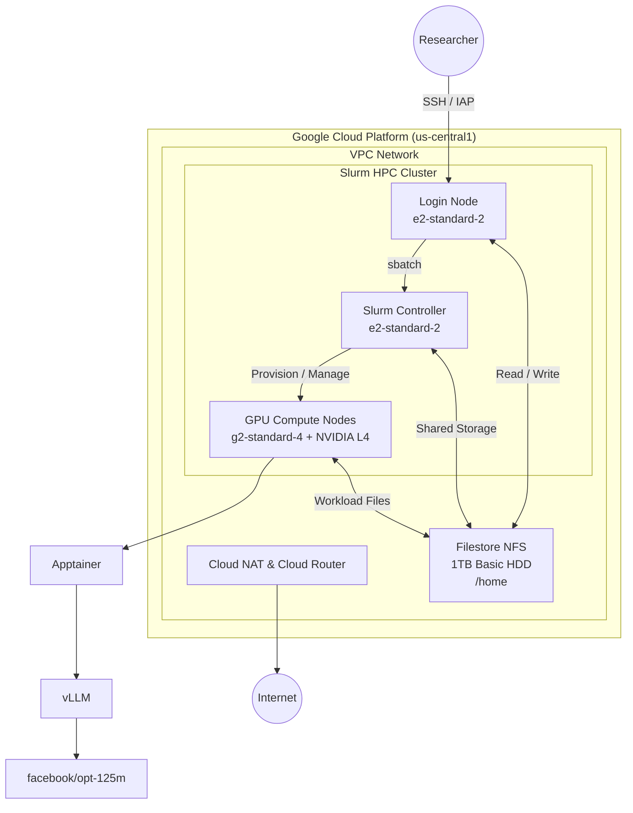

# KAUST HPC AI Inference Lab

A practical HPC/AI infrastructure project demonstrating how GPU-based LLM workloads can be provisioned, scheduled, containerized, monitored, and troubleshot using Slurm on Google Cloud.

## Architecture



## What This Project Demonstrates

- **Slurm HPC:** Job scheduling and GPU resource allocation
- **Google Cloud HPC:** Elastic GPU compute infrastructure
- **Infrastructure as Code:** Cluster Toolkit + Terraform
- **AI Workloads:** LLM inference using vLLM
- **HPC Containers:** Apptainer/Singularity
- **Shared Storage:** Filestore mounted at `/home`
- **Operations:** Slurm job and node monitoring
- **Troubleshooting:** Diagnosing pending jobs and cloud provisioning failures

## Repository Structure

```text
kaust-hpc-inference/
├── README.md
├── kaust-ai-slurm.yaml
├── serve-llm.sbatch
└── nova.sh
```

### `kaust-ai-slurm.yaml`

Cluster Toolkit blueprint defining:

- VPC
- Private Service Access
- Filestore
- Slurm controller
- Login node
- GPU nodeset
- GPU partition

### `serve-llm.sbatch`

Slurm batch job that requests a GPU and launches the vLLM inference server inside an Apptainer container.

Example:

```bash
sbatch serve-llm.sbatch
```

### `nova.sh`

Lightweight cluster monitoring utility built around:

```bash
squeue
sinfo
```

It provides visibility into active jobs and node utilization.

## Troubleshooting Case

During testing, an inference job remained in the `PENDING` state.

Investigation across the Slurm and cloud provisioning layers identified:

```text
Quota 'GPUS_ALL_REGIONS' exceeded
```

The incident demonstrated the importance of tracing HPC failures across multiple layers:

```text
Job
 ↓
Slurm
 ↓
GPU Node Provisioning
 ↓
Google Cloud API
 ↓
GPU Quota
```

A scheduler-visible `PENDING` state can therefore originate from an underlying cloud infrastructure constraint.

## Technologies

| Area | Technology |
|---|---|
| Cloud | Google Cloud |
| HPC Scheduler | Slurm |
| IaC | Terraform |
| Cluster Provisioning | Google Cloud Cluster Toolkit |
| GPU | NVIDIA L4 |
| Container Runtime | Apptainer |
| LLM Serving | vLLM |
| Storage | Filestore |
| Monitoring | Bash / Slurm CLI |

## Project Status

- [x] Slurm architecture
- [x] Cluster Toolkit blueprint
- [x] GPU partition configuration
- [x] Shared storage configuration
- [x] Apptainer/vLLM workload
- [x] Slurm monitoring utility
- [x] Infrastructure troubleshooting exercise
- [ ] Full GPU deployment validation
- [ ] GPU telemetry with DCGM/Prometheus
- [ ] Advanced HPC support CLI

## Purpose

This project was built as a hands-on AI/HPC support laboratory, focusing on the infrastructure and operational challenges involved in running GPU-based research workloads on a Slurm cluster.


This version is intentionally **much tighter** than the previous README. It gives a recruiter/interviewer the three things they need immediately:

**What is it → how is it built → what did you actually troubleshoot.**
